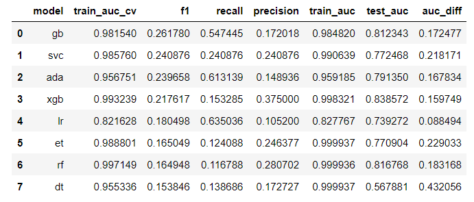

# Project 4: West Nile Virus
**Members**: DJ  | Nazira  |  Sean  |  Shuyi

# Background

West Nile virus (WNV), a mosquito-borne zoonotic disease, was first identified in the United States in the summer of 1999 in New York City. Since its first successful invasion in New York, WNV quickly adapted to the local populations of Culex vector mosquitoes and avian populations and rapidly spread throughout the United States. 

The first major WNV outbreak in the United States was observed in 2002, when more than 4,150 human cases and 284 deaths attributable to WNV infection were reported to the CDC from 40 states compared to only 149 cases and 19 deaths from 10 states cumulatively during the three years from 1999 to 2001. This stirred a prompt public health response from federal, state, and local public health agencies and led to the establishment of a more robust surveillance of mosquitoes and birds to monitor and control the spread of WNV.

Public health surveillance for West Nile virus (WNV) involves collection and testing of Culex vector mosquitoes, collection and testing of dead birds suspected to have died of WNV, testing of sentinel chickens or of wild birds captured for this purpose, and reporting of cases of human and equine illness. The ultimate goal of these surveillance data is to target mosquito control, and thereby reduce illness through the reduction of the number of infected vector mosquitoes, and to target educational messages to warn citizens to reduce individual exposure. 

One additional advantage of having a strong surveillance system in place is that the long-term data generated can be integrated with publicly available weather, landscape, and socioeconomic data and can be used effectively to identify the important drivers of WNV transmission and to develop predictive models.

In Illinois, WNV human infections have been endemic since 2002, with annual variability in the number of cases. The majority of the human WNV cases have been reported from the northeastern region, where the largest number of people in the state is congregated.

# Problem Statement

**What we are looking to solve**: We are looking to improve the cost-effectiveness of existing strategies in tackling adult mosquito populations and mitigating the spread of the West Nile Virus (WMV). 

**How we plan on solving it**: We will build a machine learning algorithm to predict the presence of the West Nile Virus, using data on past weather conditions and locations where the WMV was detected.

**Proposed Implementation**: Our tool can be employed to effectively carry out targeted spraying of specific at-risk neighbourhoods. This will ultimately help the City of Chicago save costs and better re-allocate resources in its task to prevent / mitigate the spread of the WMV.

**Success evaluation**: We evaluate success as the final model being able to provide sufficiently high level of classification accuracy based on:

1. F1 score: Where it doesn't only take into account number of prediction errors but the type of errors made, hence suitable for imbalanced class problems

2. AUC ROC score: Classification separability will be our metric to determine how distinctive classes are

**Who cares?** Any person who is living within potential breeding hotspots for mosquitoes bearing West Nile virus. With a larger social and economic impact extending to next of kin.

**Audience and the primary and secondary stakeholders**: We are presenting to members of the CDC, biostatisticians and epidemiologists & decision-makers. To address the concerns of the primary stakeholders, the government and residents of the Chicago. Secondary stakeholders are residents of Illinois. 

# Scope of the project

1. Cleaning, EDA, Preprocessing
2. Inferential and descriptive statistical analysis
3. Distribution examination
4. SMOTE oversampling for imbalanced class management
5. Performing necessary data scaling
6. Data modeling
7. Hyperparameters tuning
8. SHAP model interpretation
9. Cost benefit analysis
10. Conclusion
11. Recommendation

# Summary of our findings

Using XGBoost as our model, we achieved an ROC AUC of 0.84-85 (See comparison with other models above). The results show that week and month of the year were top predictors for our model, followed by several clusters (geolocations), average temperature, humidity and the pipiens species. This likely indicates that WNV is likely seasonal.

We believe further improvements can be made to the model (if given enough time). Here are some of our considerations:
* There could be a bias for certain traps (Given that a particular trap may always capture more mosquitos, etc)
* Possibility of a daily multiplier given an array of outbreaks; Outbreaks will possibly influence the days before and after it (They tend to cluster in the dimension of time too

After conducting a cost-benefit analysis, we've found that there are cost savings from reducing WNV cases. As we observed some **seasonality effects** in our model (i.e. week and month), it may be more efficient to start spraying based on seasonal spikes in July-August before they peak later.

